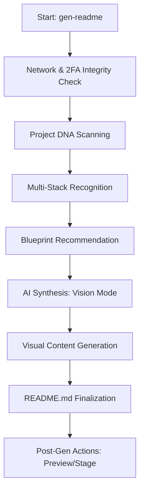

<div align="center">

# 🚀 README Genesis
### Elite AI-Powered CLI for Industry-Standard Project Documentation

[](https://www.npmjs.com/package/readme-genesis)
[](https://nodejs.org/)
[](LICENSE)
[](https://www.npmjs.com/package/readme-genesis)

[Features](#features) • [Installation](#installation) • [Usage](#usage) • [Architecture](#architecture) • [Stack](#tech-stack)

</div>

---

## 💡 The Value Proposition

| **The Problem** | **The Genesis Solution** | **The Result** |
| :--- | :--- | :--- |
| Writing documentation is 10% coding, 90% fluff. | We analyze project DNA to extract pure architectural value. | Professional READMEs in < 30 seconds. |
| READMEs often lack technical depth (diagrams/tables). | **Automated** Mermaid flowcharts, ASCII trees, and data tables. | Documentation that actually explains how it works. |
| Inconsistent standards across different project types. | Intelligence tailored to **React**, **Node**, **Python**, **Go**, and **Rust**. | High-conversion layout that looks senior-level. |

---

## 📦 Installation

### Global Install (Recommended)
```bash
npm install -g readme-genesis
```

### Quick Run
```bash
npx readme-genesis
```

---

## 🏗️ Architecture

### Logic Flow



### High-Fidelity Structure
```text
.
├── bin/
│   └── index.js       # CLI Orchestrator: Handles UI, 2FA, and Flow.
├── lib/
│   ├── analyzer.js    # Intelligence Hub: Context scanning & AI Prompting.
│   └── analyzer.test.js # Logic Validation: Ensuring recommendation accuracy.
├── templates/
│   └── minimal.js     # Blueprint Core: Base structure for synthesis.
├── package.json       # Metadata & Engine Requirements.
└── README.md          # Visual-first documentation (this file).
```

---

## 🛠️ API & Usage

### Commands
| Command | Action |
| :--- | :--- |
| `gen-readme` | Start the interactive documentation engine. |
| `gen-readme config` | Manage API keys and global settings. |

### Environment Variables
| Variable | Required | Purpose |
| :--- | :--- | :--- |
| `GEMINI_API_KEY` | Yes | Powers the AI synthesis engine. |

---

## ⚡ Tech Stack

| Component | Tooling | Purpose |
| :--- | :--- | :--- |
| **Logic Engine** | Google Gemini 1.5 Flash | High-fidelity architectural analysis. |
| **CLI Framework** | Commander.js | Robust command & flag parsing. |
| **UI/UX** | Inquirer & Chalk | Interactive, vibrant terminal interface. |
| **Verification** | Vitest | Reliable unit testing for recommendation logic. |

---

## 🔮 Roadmap

- [ ] **Blueprint Overrides**: User-defined custom documentation styles.
- [ ] **Multi-Model Support**: Integration with GPT-4 and Claude.
- [ ] **CI/CD Integration**: Automatically update README on every push.
- [ ] **Deep Code Analysis**: Auto-generate Mermaid sequence diagrams from logic routes.

---

<div align="center">
Built with ❤️ by [Srikanta](https://github.com/srikanta2006)
</div>