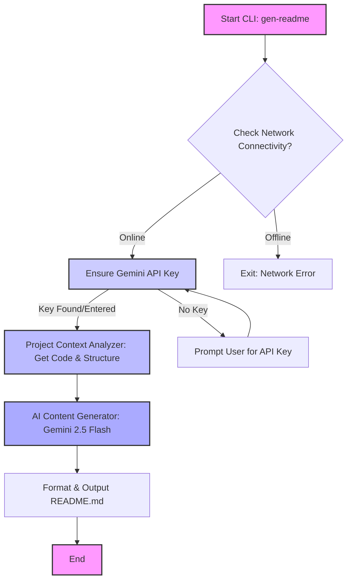

<div align="center">

# README GENESIS PRO

### AI-Powered Documentation Engine for Technical Projects

[](https://nodejs.org/)
[](LICENSE)
[](package.json)

[✨ Features](#-features) • [🚀 Installation](#-installation) • [💡 Usage](#-usage) • [🏗️ Architecture](#-architecture)

</div>

---

## 🔥 The Value Proposition

Tired of manual, time-consuming README creation? **README GENESIS PRO** automates the documentation process, delivering high-quality, context-aware `README.md` files for your technical projects.

*   **Problem:** Crafting comprehensive, up-to-date READMEs is a repetitive chore, often leading to inconsistent or outdated documentation.
*   **Solution:** Leverage cutting-edge AI to instantly analyze your project's DNA and generate a professional, structured `README.md`.
*   **Benefit:** Save hours of development time, ensure documentation consistency, and enhance project discoverability with an always-fresh README.

### Quick Start

```bash
npx gen-readme
```

---

## ✨ Features

*   **AI-Driven Content Generation:** Utilizes advanced AI (Gemini 2.5 Flash) to understand your project and draft relevant documentation.
*   **Context-Aware Analysis:** Scans your project's structure, dependencies, and code snippets to generate highly pertinent content.
*   **Interactive Setup:** Guides you through API key configuration, storing it securely for future use.
*   **CLI-First Experience:** Seamless integration into your development workflow via a powerful command-line interface.
*   **Global Configuration:** Persists your API key locally, so you only need to set it up once.

---

## 🏗️ Architecture & Logic Flow

**README GENESIS PRO** operates as a smart CLI utility, orchestrating project analysis and AI-driven content generation.



### Architectural Patterns

| Pattern                  | Description                                            | Implementation Detail                                   |
| :----------------------- | :----------------------------------------------------- | :------------------------------------------------------ |
| **CLI Application**      | User interaction via command-line interface.           | `commander`, `inquirer`, `chalk`, `ora`, `boxen`        |
| **Configuration Mgmt.**  | Centralized and persistent storage of settings.        | `dotenv`, `configstore` for API keys and global settings |
| **AI Integration**       | Leverages external AI models for core functionality.   | `gemini-2.5-flash` via `lib/analyzer.js`                 |
| **Project Contextualization** | Analyzes local project files and structure to inform AI. | `lib/analyzer.js` (`getProjectContext`)                  |
| **Network Resilience**   | Gracefully handles network availability.               | `dns` lookup before AI requests                         |

---

## 📁 Project Structure

A clear overview of the project's file and directory organization.

```
.
├── templates/                 # Directory for different README generation templates
│   └── minimal.js             # Example minimal README template
├── lib/                       # Core logic and utility modules
│   ├── config.js              # Centralized configuration (e.g., AI model name)
│   ├── analyzer.test.js       # Unit tests for the project analyzer
│   └── analyzer.js            # Core logic for project analysis and AI interaction
├── bin/                       # Executable scripts
│   └── index.js               # CLI entry point for the 'gen-readme' command
├── README.md                  # This documentation file
├── package.json               # Project metadata, scripts, and dependencies
└── auto-readme-cli-1.0.0.tgz  # Packaged CLI for distribution (example)
```

---

## 🚀 Installation

Install `README GENESIS PRO` globally to use the `gen-readme` command anywhere on your system.

### Global Installation

```bash
npm install -g readme-genesis
# OR
yarn global add readme-genesis
```

### Using with `npx` (No Global Install)

For a quick, one-time execution without installing globally:

```bash
npx gen-readme
```

---

## 💡 Usage

Run the `gen-readme` command in the root of your technical project.

```bash
gen-readme
```

### API Key Configuration

`README GENESIS PRO` requires a Google Gemini API Key.

| Variable           | Type                  | Required | Description                                                                                             |
| :----------------- | :-------------------- | :------- | :------------------------------------------------------------------------------------------------------ |
| `GEMINI_API_KEY`   | Environment Variable  | Yes      | Your Google Gemini API Key. Can be set in your `.env` file or entered interactively on first run.       |

*   **First Run:** If `GEMINI_API_KEY` is not found in your environment or stored globally, the CLI will interactively prompt you to enter it. The key will then be securely stored using `configstore` for future invocations.
*   **Get Your Key:** Obtain a free Gemini API Key from [AI Studio](https://aistudio.google.com/app/apikey).

---

## 🛠️ Core Dependencies

Key third-party tools and libraries that power `README GENESIS PRO`.

| Tool            | Purpose                                       | Version (min) |
| :-------------- | :-------------------------------------------- | :------------ |
| `commander`     | Elegant command-line interfaces.             | `>=9.0.0`     |
| `inquirer`      | Interactive prompts for user input.           | `>=8.0.0`     |
| `chalk`         | Terminal string styling.                      | `>=5.0.0`     |
| `ora`           | Elegant terminal spinner.                     | `>=6.0.0`     |
| `boxen`         | Draw boxes in the terminal.                   | `>=7.0.0`     |
| `configstore`   | Persist user configuration.                   | `>=6.0.0`     |
| `dotenv`        | Load environment variables from `.env` file.  | `>=16.0.0`    |
| `dns` (Node.js) | Network connectivity checks.                  | `Built-in`    |
| `fs` (Node.js)  | File system operations.                       | `Built-in`    |
| `child_process` | Spawning child processes (e.g., for analysis).| `Built-in`    |

---

## 🛣️ Roadmap

Our vision for the future of `README GENESIS PRO`.

*   **Alpha (Current)**
    *   [x] Basic Project Structure Analysis
    *   [x] AI-Powered Content Generation (Gemini 2.5 Flash)
    *   [x] Interactive API Key Management & Persistence
    *   [x] Basic Network Connectivity Check
*   **Beta (Next Steps)**
    *   [ ] Support for Custom README Templates (e.g., using EJS, Handlebars)
    *   [ ] Integration with Git (analyzing commit history for more context)
    *   [ ] Advanced Project Type Detection (e.g., web app, library, microservice)
    *   [ ] Command-line Options for Customization (e.g., `--output`, `--template`)
    *   [ ] Comprehensive Error Handling and User Feedback
*   **Future (Beyond Beta)**
    *   [ ] Multi-language README Generation
    *   [ ] Integration with CI/CD Pipelines for automated README updates
    *   [ ] Support for additional AI models and providers
    *   [ ] Web-based UI for advanced configuration and previews